# ZotSeek - Semantic Search for Zotero

A Zotero plugin that adds **AI-powered semantic search** to your library. Find similar papers based on meaning, not just keywords.

> **Status:** ✅ Stable release with Transformers.js running locally in Zotero 8


---

## Features

- 🔒 **100% Local** - No data sent to cloud, works completely offline
- 🧠 **True Semantic Search** - Find papers by meaning, not just keywords
- 🔍 **Find Similar Documents** - Right-click any paper → discover related research
- 🔎 **Natural Language Search** - Search with queries like "machine learning in healthcare"
- 🔗 **Hybrid Search** - Combines AI + keyword search for best results
- ⚡ **Lightning Fast** - Searches complete in <100ms
- 📑 **Section-Aware** - See which section matched (Abstract, Methods, Results)
- ⚙️ **Configurable** - Customize via Zotero Settings → ZotSeek

---

## More Screenshots

<details>
<summary>Click to expand</summary>

### Find Similar Documents


### Context Menu


### Settings Panel


### Indexing Progress


</details>

---

## How It Works

### The Big Picture

```mermaid
flowchart LR
    subgraph INDEXING["📥 INDEXING (one-time)"]
        P["📄 Paper<br/>Title + Abstract"]
        M["🤖 AI Model<br/>nomic-embed-v1.5"]
        E["[0.023, -0.045, ...]<br/>768 numbers"]
        P --> M --> E
    end
    
    subgraph SEARCHING["🔍 SEARCHING"]
        Q["📄 Query"]
        QE["Query Embedding"]
        Q --> QE
    end
    
    subgraph LIBRARY["📚 Library Embeddings"]
        A["Paper A: [0.021, -0.048, ...]"]
        B["Paper B: [0.089, 0.012, ...]"]
        C["Paper C: [0.025, -0.041, ...]"]
    end
    
    E --> LIBRARY
    QE -->|"Cosine Similarity"| LIBRARY
    LIBRARY --> R["📊 Results<br/>A: 94% · C: 89% · B: 23%"]
```



**How it works:** Each paper becomes a list of 768 numbers (an "embedding") that captures its meaning. Similar papers have similar numbers, so we can find related research by comparing these numbers.

### Step-by-Step Process

#### 1️⃣ Indexing Your Library

When you use "Index Current Collection" or "Update Library Index":

```
For each paper:
  1. Extract title + abstract (or full PDF text)
  2. Split into semantic chunks if needed
  3. Send to local AI model (nomic-embed-text-v1.5)
  4. Model outputs 768 numbers per chunk (the "embedding")
  5. Save embeddings to Zotero's database
```

**Time:** ~3 seconds per chunk

#### 2️⃣ Finding Similar Documents

When you right-click → "Find Similar Documents":

```
  1. Load the selected paper's embedding
  2. Compare against all indexed papers (cached in memory)
  3. Rank by semantic similarity
  4. Show top results
```

**Time:** ~70ms (with cache)

---

## Hybrid Search

The plugin combines **semantic search** (AI embeddings) with **Zotero's keyword search** using **Reciprocal Rank Fusion (RRF)** for optimal results.

### Search Modes

| Mode | Best For | How It Works |
|------|----------|--------------|
| 🔗 **Hybrid** (Recommended) | Most searches | Combines semantic + keyword results |
| 🧠 **Semantic Only** | Conceptual queries | Finds related papers by meaning |
| 🔤 **Keyword Only** | Author/year searches | Exact title, author, year matching |

### Why Hybrid Search?

| Query Type | Pure Semantic | Pure Keyword | Hybrid |
|------------|---------------|--------------|--------|
| "trust in AI" | ✅ Great | ❌ Poor | ✅ Great |
| "Smith 2023" | ❌ Poor | ✅ Great | ✅ Great |
| "RLHF" | ⚠️ Maybe | ✅ Exact only | ✅ Both |

### Result Indicators

| Icon | Meaning |
|------|---------|
| 🔗 | Found by BOTH semantic and keyword (high confidence) |
| 🧠 | Found by semantic search only (conceptually related) |
| 🔤 | Found by keyword search only (exact match) |

### Section-Aware Results

The **Source** column shows which section of the paper matched your query:

| Source | Section Type |
|--------|--------------|
| Abstract | Title + Abstract |
| Methods | Introduction, Background, Methods |
| Results | Results, Discussion, Conclusions |
| Content | Generic (sections not detected) |

For technical details, see [docs/SEARCH_ARCHITECTURE.md](docs/SEARCH_ARCHITECTURE.md).

---

## Indexing Modes

| Mode | What Gets Indexed | Best For |
|------|-------------------|----------|
| **Abstract** (default) | Title + Abstract | Fast indexing, most use cases |
| **Full Document** | PDF content split by sections | Deep content search |

Configure via **Zotero → Settings → ZotSeek**.

### How Full Document Mode Works

For papers with PDFs, the chunker:
1. Splits at section headers (Introduction, Methods, Results, etc.)
2. Splits large sections by paragraphs
3. Prepends title to each chunk for context

When searching, if *any* chunk matches your query, the paper ranks highly (MaxSim aggregation).

---

## The AI Model

### nomic-embed-text-v1.5

| Property | Value |
|----------|-------|
| **Name** | [nomic-ai/nomic-embed-text-v1.5](https://huggingface.co/nomic-ai/nomic-embed-text-v1.5) |
| **Size** | 131 MB (quantized) |
| **Dimensions** | 768 (Matryoshka - can truncate to 256/128) |
| **Context Window** | 8192 tokens |
| **Speed** | ~3 seconds per chunk |
| **Quality** | Outperforms OpenAI text-embedding-3-small on MTEB |
| **Special Feature** | Instruction-aware prefixes for queries vs documents |

### Why This Model?

- ✅ **Superior retrieval quality** - Outperforms OpenAI text-embedding-3-small and jina-v2 on MTEB benchmarks
- ✅ **8K context window** - Most papers fit in 1-3 chunks (vs 10-20 with 512-token models)
- ✅ **Instruction-aware** - Uses `search_document:` for indexing and `search_query:` for queries
- ✅ **Matryoshka embeddings** - 768 dims can be truncated to 256/128 with minimal quality loss
- ✅ **Fully open** - Open weights, open training data, reproducible
- ✅ **Works in Zotero** - Compatible with Transformers.js v3 via wasmPaths configuration

### How Embeddings Work

The model converts text into 768 numbers that capture semantic meaning:

```
"Machine learning for medical diagnosis"  →  [0.023, -0.045, 0.012, ...]
"AI in healthcare applications"           →  [0.021, -0.048, 0.015, ...]  ← Similar!
"Organic chemistry synthesis"             →  [-0.089, 0.034, 0.067, ...]  ← Different!
```

Papers with **similar meanings** have **similar numbers**, even if they use different words.

---

## Architecture

### System Overview

```mermaid
flowchart TB
    subgraph ZOTERO["🔬 ZOTERO"]
        subgraph MAIN["Main Thread"]
            A["Plugin Logic<br/>(index.ts)"]
            B["Vector Store<br/>(SQLite)"]
            C["Search Engine<br/>(cosine similarity)"]
        end
        
        subgraph WORKER["ChromeWorker Thread"]
            D["embedding-worker.ts"]
            E["Transformers.js<br/>(ONNX Runtime)"]
            F["nomic-embed-text-v1.5<br/>(bundled, 131MB)"]
        end
    end
    
    A -->|"postMessage()"| D
    D --> E
    E --> F
    D -->|"embedding[]"| A
    A <--> B
    A <--> C
```



### Why ChromeWorker?

Transformers.js can't run directly in Zotero's main thread because:
- Missing browser globals (`self`, `navigator`, `indexedDB`)
- Cache API crashes Zotero
- Would block UI during model inference

**Solution:** Run in a separate ChromeWorker thread with special configuration.

### Data Storage

Embeddings are stored in **SQLite tables** within Zotero's main database (`zotero.sqlite`):

- **Location:** Tables with `zs_` prefix in Zotero's database
- **Size:** ~15KB per paper (abstract mode), ~150KB per paper (full document mode)
- **Benefits:** O(1) indexed lookups, in-memory caching, atomic updates

The SQLite backend includes:
- **Smart caching** - Pre-normalized Float32Arrays cached in memory after first search
- **Reliable queries** - Uses `columnQueryAsync()` and `valueQueryAsync()` for robust data retrieval
- **Automatic cleanup** - Data is managed alongside Zotero's database

---

## Cosine Similarity

The math behind "how similar are two papers":

$$\text{similarity} = \frac{A \cdot B}{\|A\| \times \|B\|}$$

Where:
- **A · B** = sum of (a[i] × b[i]) for all 768 dimensions
- **‖A‖** = sqrt(sum of a[i]²)
- **‖B‖** = sqrt(sum of b[i]²)

**Result:** 0.0 (completely different) to 1.0 (identical)

**Interpretation:**
- 0.9+ = Very similar (probably same topic)
- 0.7-0.9 = Related topics
- 0.5-0.7 = Loosely related
- <0.5 = Different topics

---

## Installation

### Development Setup

```bash
# Clone the repository
git clone https://github.com/introfini/ZotSeek
cd zotseek

# Install dependencies (includes zotero-plugin-toolkit for stable progress windows)
npm install

# Build the plugin
npm run build

# Create extension proxy file (macOS)
echo "$(pwd)/build" > ~/Library/Application\ Support/Zotero/Profiles/*.default/extensions/zotseek@zotero.org

# Restart Zotero with debug console
open -a Zotero --args -purgecaches -ZoteroDebugText -jsconsole
```

### Building for Distribution

```bash
cd build
zip -r ../zotseek.xpi *
```

Install via: Zotero → Tools → Add-ons → Install Add-on From File

---

## Usage

### Index Your Library

1. Right-click on a collection → **"Index Current Collection"**
2. Or use **"Update Library Index"** to index all items
3. A progress window will appear showing:
   - Current item being processed
   - Progress percentage
   - Estimated time remaining (ETA)
   - Option to cancel at any time
4. Indexing speed: ~3 seconds per chunk

**Progress Window Features:**
- ✅ AI model loaded status
- ✅ Extraction progress (chunks from items)
- 📊 Current paper being processed
- 📈 Progress bar with percentage
- ⏱️ ETA countdown
- ❌ Cancel button

### Find Similar Documents

1. Select any paper in your library
2. Right-click → **"Find Similar Documents"**
3. Results appear showing similarity percentages

### ZotSeek Search Dialog

1. Click the **ZotSeek button** in the toolbar (🔍✨)
2. Or right-click → **"Open ZotSeek..."**
3. Enter a natural language query (e.g., "machine learning for medical diagnosis")
4. View results ranked by semantic similarity
5. Double-click any result to open it in Zotero

### View Debug Output

Help → Debug Output Logging → View Output

Look for `[ZotSeek]` entries.

---

## Configuration

### Settings Panel

Access settings via **Zotero → Settings → ZotSeek** (or **Zotero → Preferences** on macOS).

The settings panel allows you to configure:
- **Indexing Mode**: Abstract only or Full Document
- **Search Options**: Maximum results, minimum similarity threshold
- **Actions**: Clear index, re-index library

### Preferences Reference

Preferences are stored in Zotero's preferences system:

**Search Settings:**

| Preference | Default | Description |
|------------|---------|-------------|
| `zotseek.minSimilarityPercent` | `30` | Minimum similarity % to show in results |
| `zotseek.topK` | `20` | Maximum number of results |
| `zotseek.autoIndex` | `false` | Auto-index new papers (not implemented yet) |

**Indexing Settings:**

| Preference | Default | Description |
|------------|---------|-------------|
| `zotseek.indexingMode` | `"abstract"` | `"abstract"` or `"full"` |
| `zotseek.maxTokens` | `2000` | Max tokens per chunk (optimized for speed) |
| `zotseek.maxChunksPerPaper` | `8` | Max chunks per paper |

**Hybrid Search Settings:**

| Preference | Default | Description |
|------------|---------|-------------|
| `zotseek.hybridSearch.enabled` | `true` | Enable hybrid search |
| `zotseek.hybridSearch.mode` | `"hybrid"` | `"hybrid"`, `"semantic"`, or `"keyword"` |
| `zotseek.hybridSearch.semanticWeightPercent` | `50` | Semantic weight (0-100) |
| `zotseek.hybridSearch.rrfK` | `60` | RRF constant |
| `zotseek.hybridSearch.autoAdjustWeights` | `true` | Auto-adjust based on query |

You can also access preferences via `about:config` (Help → Debug Output Logging → View Output, then navigate to `about:config`).

---

## Performance

Tested on MacBook Pro M3:

| Operation | Time |
|-----------|------|
| Model loading | ~1.5 seconds (bundled, 131MB) |
| Index 1 chunk | ~3 seconds (optimized from ~45s) |
| Index 10 papers (40 chunks) | ~2 minutes |
| **First search** | ~130ms (loads cache) |
| **Subsequent searches** | **~70ms** (uses cache) |
| **Hybrid search** | ~70ms (with cache) |
| Storage size | ~130 KB per 10 papers (full mode) |
| Memory usage (cached) | +75MB for 1,000 papers |

### Performance Optimizations

The plugin includes several performance optimizations:

1. **Optimized Chunk Size** - 2000 tokens (~3s) vs 7000 tokens (~45s) due to O(n²) attention
2. **In-Memory Caching** - Embeddings cached after first search
3. **Pre-normalized Vectors** - Float32Arrays normalized on load for fast dot product
4. **Parallel Searches** - Semantic and keyword searches run simultaneously
5. **Reliable SQLite Methods** - Uses `columnQueryAsync()` and `valueQueryAsync()`

---

## Limitations

- **English only** - Model is trained on English text
- **Large plugin size** - ~131MB due to bundled AI model

---

## Comparison with OpenAI

| Feature | This Plugin (Local) | OpenAI API |
|---------|--------------------| -----------|
| **Cost** | Free | ~$0.02 per 1K papers |
| **Privacy** | 100% local | Data sent to OpenAI |
| **Offline** | Yes (after model loads) | No |
| **Quality** | Excellent (outperforms text-embedding-3-small) | Good |
| **Speed** | ~70-130ms | ~100ms |
| **Context** | 8192 tokens | 8191 tokens |

---

## Technical Details

See the [docs/](docs/) folder for detailed documentation:

- [**DEVELOPMENT.md**](docs/DEVELOPMENT.md) - Development guide, ChromeWorker + Transformers.js implementation
- [**SEARCH_ARCHITECTURE.md**](docs/SEARCH_ARCHITECTURE.md) - Hybrid search, RRF fusion, chunking strategy

---

## Changelog

See [CHANGELOG.md](CHANGELOG.md) for version history.

## License

MIT License - see [LICENSE](LICENSE)

---

## Acknowledgments

- [Transformers.js](https://huggingface.co/docs/transformers.js) by Hugging Face
- [sentence-transformers](https://www.sbert.net/) for the embedding model
- [Zotero](https://www.zotero.org/) for the amazing reference manager
- [windingwind's Zotero Plugin Docs](https://windingwind.github.io/doc-for-zotero-plugin-dev/) for invaluable guidance

---

*ZotSeek is built by José Fernandes for semantic search in academic research.*
